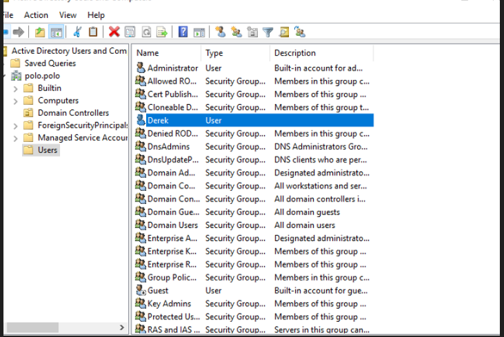
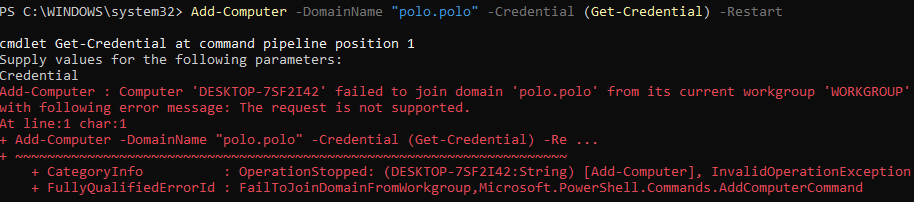
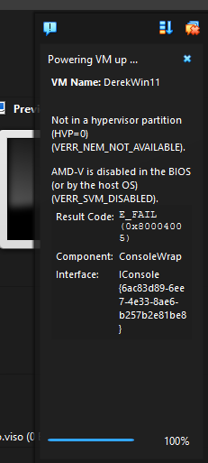
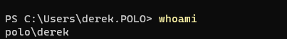

# Windows-Homelab
Windows Homelab to practice IT

Overview

I've made this setup before with a VM hosting the server, and then as my second PC running the server, but it's since been wiped which gives me an opportunity to try to do it myself without significant assistance from AI and/or the internet. Running the server on an Optiplex 9020.

Step 1: Get windows server on my other PC. 

I can use that PC to host the active directory and then I can use my main PC to connect to it and host VM's to simulate multiple users. I dont have a flash drive available so I'll have to install directly from windows 10.

Accidentally downloaded the non desktop version so now I have to use the command line to download the windows iso from the microsoft website and then run it again to upgrade my windows version to the desktop experience. I'm not at the level yet to use Windows Server without a GUI, although it would be a really good learning experience for the future.

This install was messed up as well, I had my boot options set to UEFI instead of legacy so the install would loop after manually selecting where to boot from. I eventually found out and changed it to legacy and now I have a fresh 2019 install.

Step 2: Set up Active Directory and DNS server.

Some things I have to remember before beginning this:

-upgrade to domain controller and add a new forest
-statically set the IP of this computer or stuff will randomly all break
-when connecting ubuntu clients, the hostname of the PC can't be anything suspicious (huge roadblock in previous setup)
-connecting a client involves making them an account, and then they have to connect to the server themselves and enter the account info I created for them.
-to connect a PC to this server I must set the DNS server of it to be the static IP of the DNS server (obviously), DNS server is default configured to my router

Firstly, I'm going to update everything I can so that I have all the drivers needed to be able to connect to the internet and change certain settings. 

I'm going to go through the built in windows setting on the server, I allowed network discovery and set the network profile to private so it is discoverable to the other PC's on my network.

Now I'm going to go into my router's webpage, login as admin, and add a dhcp reservation for my server so it won't change automatically. Following this, I reconnect to the internet and use ipconfig to find out if the IP address updated. It worked.

Next, I click add roles and features, select active directory domain services, allow group policy management, and install

named server polo.polo

Now my AD DS server is online and so is the DNS server, so I'm going to try to connect to it directly from my main PC first before I create VM's. As aforementioned, I have to make an account for myself and then set my DNS server as the IP address of the server and then try to login to it through the terminal.

Active Directory Users and Computers -> servername -> users -> new -> user -> input details and create user

Step 3: connect 

now on my main PC, I'll set the DNS server to the IP of the server, and alternate to my router so my pc still works, reset connection and test with ping

both pinging the server and nslookup work so the server is running and discoverable on my local network.

first join attempt failed with an error that explains that the request is not supported FailToJoinDomainFromWorkgroup, this might be due to DNS settings, I'll try to set the primary and seconday DNS of this PC to the server, reset my connection, and see if that works.

That didnt work either

It's not working because I'm on windows 11 home so im going to virtualize windows 11 pro and try to connect from it.

This is failing to boot because I dont have AMD-V enabled in BIOS so i will go to bios to enable it.

The account is now connected successfully and I am going to create a shared network drive using the net use command so i can sync files between the server and the VM. 

Ive now mapped the network drive to the derek user using the Net Use command and the folder is just named derek. Next, I'm going to make folders for three departments and make corresponding groups for sales and finance and add derek to each group. 

I've also made a folder for each department with a text document inside it. first I'll configure the permissions of each group so that only people in the corresponding groups can access the folders. I'll configure the sales group to have modify permissions on the sales folder.

Then I create the drive map so anybody in the sales group will be able to access this drive which will be the contents of the sales folder

I apply the targeting restrictions to the drive so only sales group users can access the drive

Now after logging into the derek VM I've found it's still inaccessible and not showing up at all. I rechecked all the settings to make sure the GPO existed, applied to sales, derek was in the sales group, and restarting. I forgot to actually share the folder over the network. 

I've also confirmed that local edits that the derek VM makes transfer successfully to the server.

Next I'm going to create another user, Ken, and put them in finance and configure a network drive for the finance group as well.

Since ken is in the finance group he is able to access the finance folder but is unable to access the sales folder but can access the finance folder. cmdline included to show different user, not just modified derek permissions.

